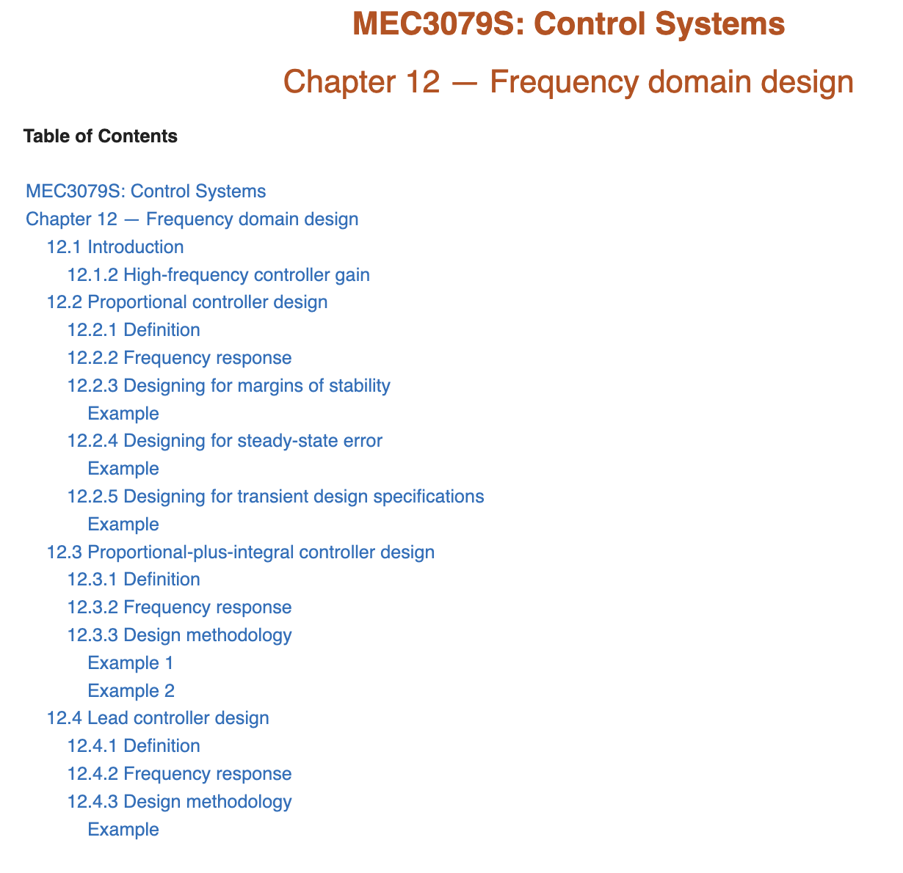
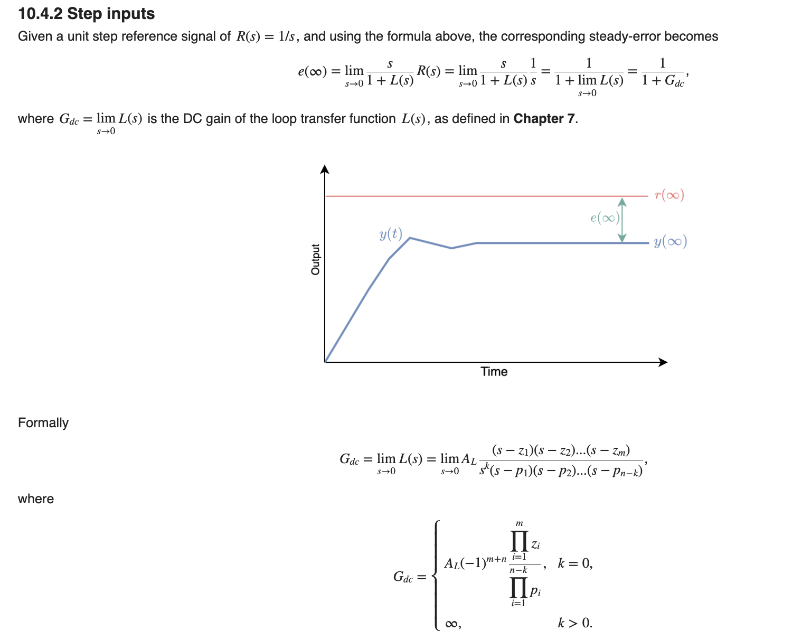
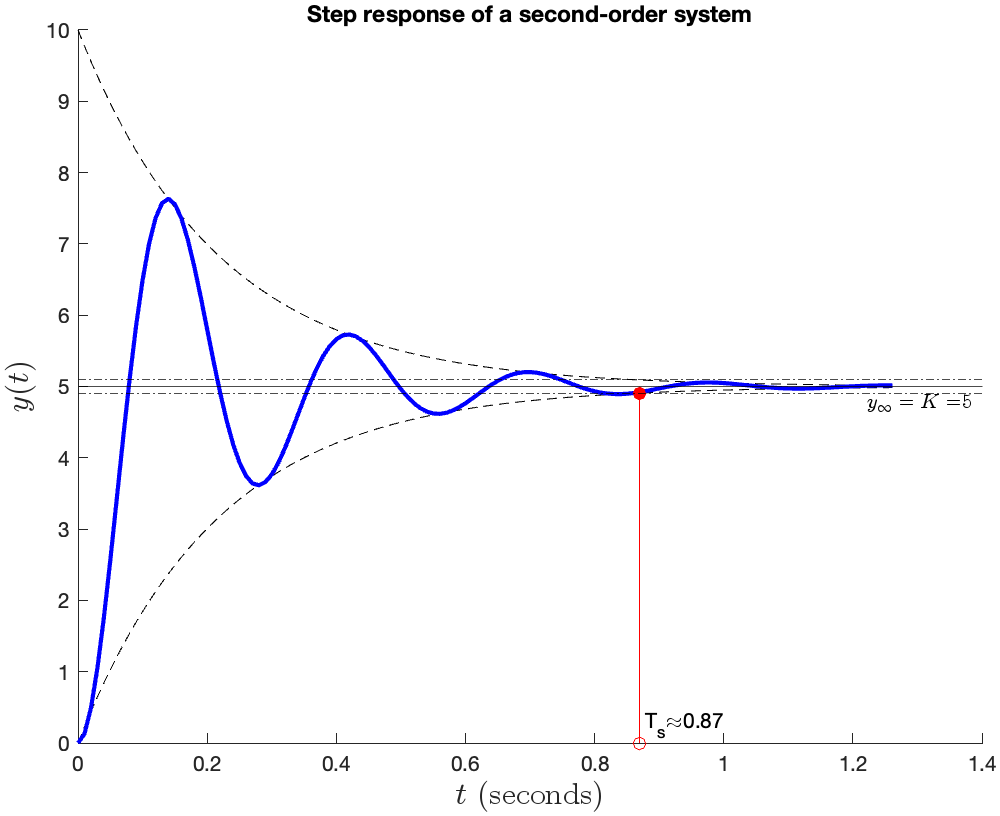
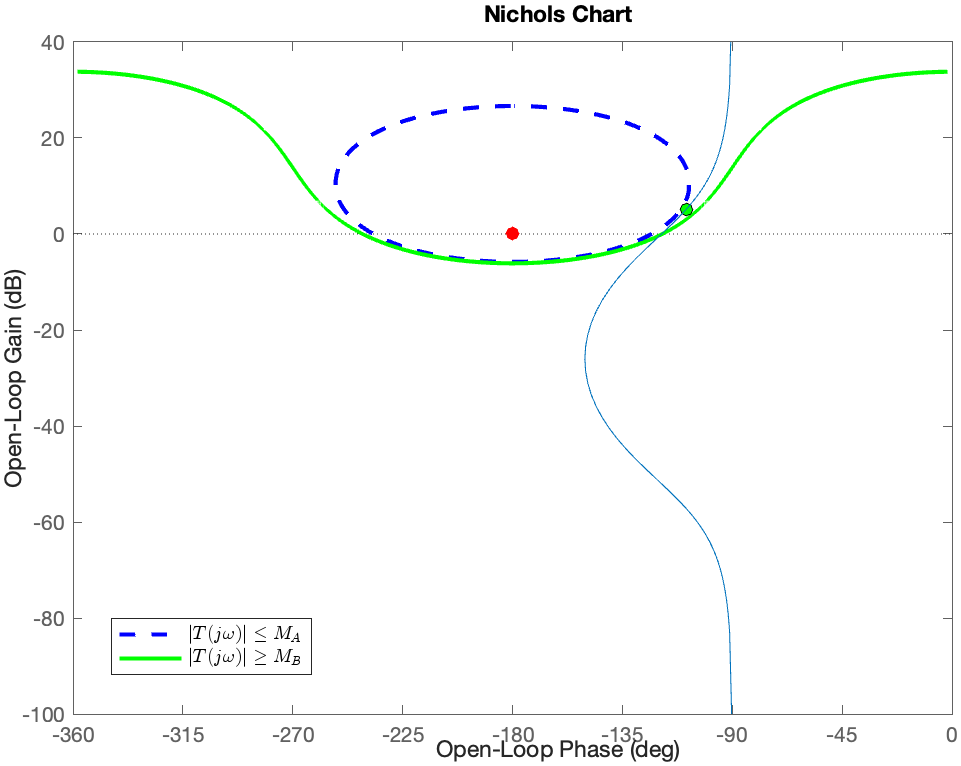
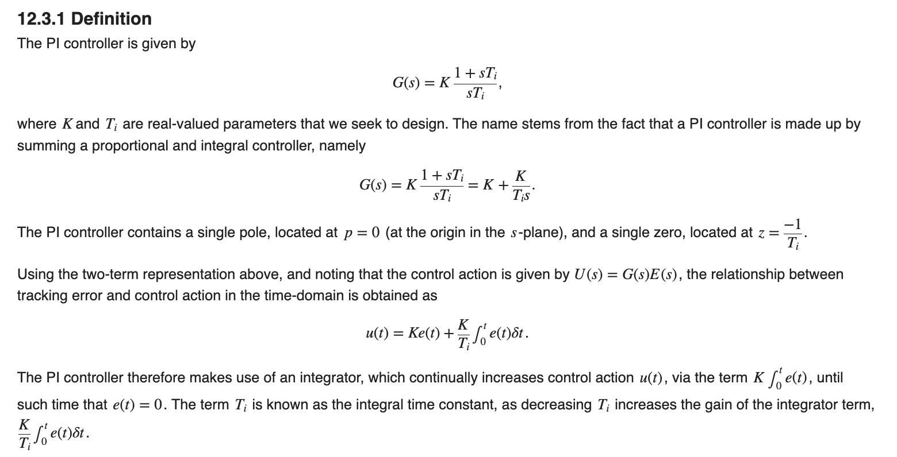
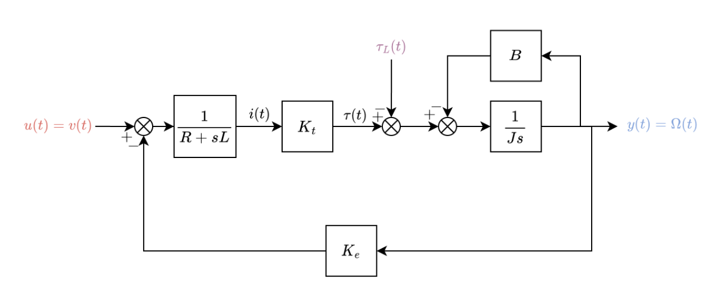
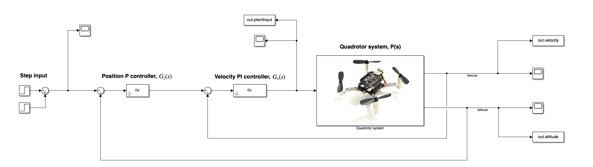
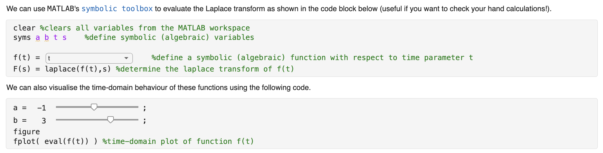

# Control-Systems

## Curriculum Module

_Created with MATLAB R2023a. Compatible with MATLAB R2023a and later releases._

2023 © Arnold Pretorius ([University of Cape Town](https://www.uct.ac.za), [Department of Mechanical Engineering, Faculty of Engineering and the Built Environment](https://ebe.uct.ac.za/department-mechanical-engineering))

## Description of content

This teaching package contains content for the course “Control Systems”, which is based heavily within based in MATLAB [Live Scripts](https://www.mathworks.com/products/matlab/live-editor.html). The teaching package comprises the following:
1. A set of interactive Course Notes, based in MATLAB Live Scripts.
2. A set of static PDF exports of the Course Notes. 
3. A set of Virtual Labs, based in MATLAB Live Scripts.
4. Multiple Projects, which is based in both MATLAB Live Scripts and Simulink.

The content of this package is intended for undergraduate students with little to no experience with MATLAB. MATLAB is a programming and numeric computing platform developed by MathWorks. 

The intention of this package is to introduce students to the fundamentals of Control Systems in an interactive manner, providing both rigorous theoretical development, along with guided demonstration and emulated practical exercises. This is made possible by making use of MATLAB Live Scripts which incorporate formatted text, LaTeX equations, imagery, and interactive code blocks.

### Important points to take note
- The weekly Virtual Labs contain questions that are meant to be answered within a Learning Management System (LMS), which for the University of Cape Town is Amathuba (an LMS based on D2L Brightspace).
  
- Worked solutions for the Virtual Labs and Projects are available and will be provide upon kind request and verification of station.

- Every week there is an online quiz within the LMS, which is intended to gauge the students familiarity with the content from the previous week. While the quizzes are for marks, the students are allowed to attempt the quizzes any number of times and receive instant feedback about their incorrect answers. These quizzes can be provided upon kind request.

- The University of Cape Town has a Campus Wide License which enables all staff members, students, and visitors to use the full suite of MATLAB products. This allows for easy access to the tools to every students from everywhere in the world. Students can use MATLAB directly in the web browser with MATLAB Online which is connected to MATLAB Drive, which gives every students 20Gb of space in the cloud.

- Students are required to complete the [MATLAB Onramp](https://matlabacademy.mathworks.com/details/matlab-onramp/gettingstarted) before engaging in the Course Notes and Virtual Labs.

## Snapshots of the teaching package

|  Table of contents found in each Chapter |   Combination of static images, formatted text, and LaTeX equations |   Information-rich code outputs |
| ----------- | ----------- | ----------- |

|   Design methods via the Nichols chart   |   Neatly sectioned and formatted content | 
| ----------- | ----------- |

|  Multi-coloured block diagrams |   Simulink quadcopter control project |   Interactive code blocks | 
| ----------- | ----------- | ----------- |

## Instructions

The course content can be approached in one of two ways:
1. Click on . This will allow you to access the content online in your web browser through MATLAB Online.
3. Download all files and access the MATLAB content from the desktop app.

### Live Scripts

The Course Notes Live Scripts are presented as an interactive textbook with numbered sections. 

Live Scripts are divided into sections and contain interactive Live Script controls which include buttons, checkboxes, sliders, and dropdown menus. Feel free to interact with these controls as well as typing in your own code snippets. You can run each section within a Live Script individually. 

The Live Scripts are intended to be executed in sections. This can be achieved by pressing the Run Section button within the MATLAB interface, or CNTRL/CMD+ENTER. 

## Content

### Course Notes
- Chapter 1 - Introduction
- Chapter 2 - Signals and systems
- Chapter 3 - Block diagrams
- Chapter 4 - Modelling the Laplace domain
- Chapter 5 - Prediction of system response
- Chapter 6 - System characterisation
- Chapter 7 - Frequency response techniques
- Chapter 8 - Feedback control systems
- Chapter 9 - Stability of closed-loop systems
- Chapter 10 - Steady-state error
- Chapter 11 - Transient design specifications
- Chapter 12 - Frequency-domain design
- Chapter 13 - Digital control systems
### Virtual Labs
- Virtual Lab 1 - Mass-spring-damper system
- Virtual Lab 2 - Armature-controlled DC motor
- Virtual Lab 3 - Torsional mass-spring-damper system
- Virtual Lab 4 - System characterisation
- Virtual Lab 5 - Underdamped second-order systems
- Virtual Lab 6 - Closed-loop stability
- Virtual Lab 7 - Steady-state error
- Virtual Lab 8 - Design specifications

### Projects
- Project 1 - Attitude control of a quadcopter
- Project 2 - Control design for a FlappyBird game

## Learning goals
The objective of this course is to provide an introduction to control systems engineering. This comprises: 

- Mathematical modelling in the frequency domain
- Converting governing linear differential equations by means of the Laplace transform
- Transfer functions
- Block diagrams and block diagram algebra
- Stability via the s-plane
- Frequency response of systems
- Frequency-domain analysis and design methods
- Z-transforms and programming equations for digital control
- Accounting for digital sampling effects.

## Suggested Prerequisites

This course requires a strong basis in vector calculus and differential equations. 

## Additional Resources

### Introduction to MATLAB

[MATLAB Onramp](https://matlabacademy.mathworks.com/details/matlab-onramp/gettingstarted) - Learn the essentials of MATLAB through this free, two-hour introductory tutorial on commonly used features and workflows.

### Educator Resources
We invite educators interested in this course material to go through the resources links provided below:
- [Featured Courseware](https://www.mathworks.com/academia/courseware/course-materials.html)
- [Teach with MATLAB and Simulink](https://www.mathworks.com/academia/educators.html)
- Feel free to contact me with your feedback; my email address is [arnold.pretorius@uct.ac.za](mailto:arnold.pretorius@uct.ac.za)

## Products

- [MATLAB](https://www.mathworks.com/products/matlab.html), 
- [Symbolic Math Toolbox™](https://www.mathworks.com/products/symbolic.html),
- [Control System Toolbox](https://www.mathworks.com/products/control.html),
- [Simulink™](https://www.mathworks.com/products/simulink.html),
- [UAV Toolbox](https://www.mathworks.com/products/uav.html),
- [MATLAB Online Trainings](https://matlabacademy.mathworks.com/).

## License

The license for this module is available in the [LICENSE](LICENSE) file in this repository.

## Acknowledgments
A huge thank you to Guy Hasewinkel, who was responsible for generating all the detailed figures and tables that are used in these notes, as well as the setup and testing of Project 2.

This Curriculum Module was developed through the support of [MathWorks](https://www.mathworks.com/). 
Special thanks to Dr. Marco Rossi from [MathWorks](https://www.mathworks.com/).
